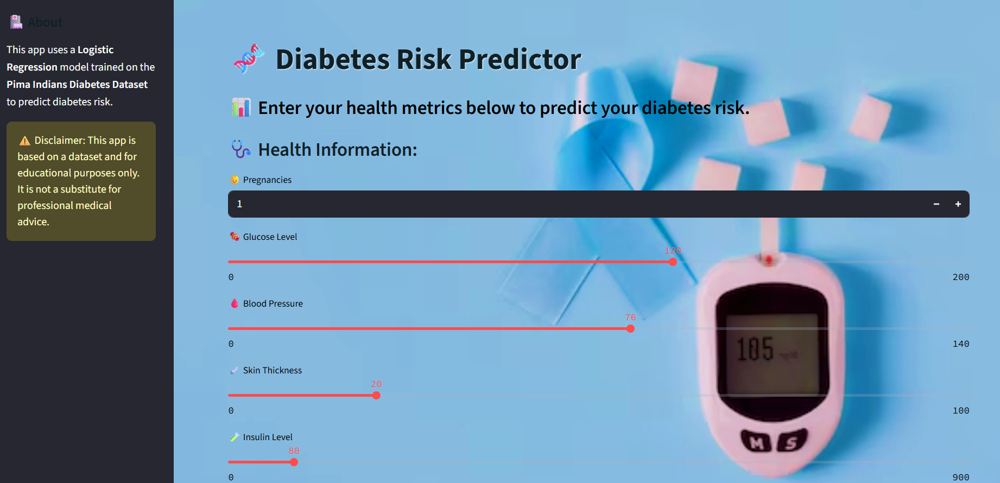

# 🦥 Diabetes Risk Predictor using Machine Learning & Streamlit


Welcome to the **Diabetes Risk Predictor** — a machine learning-powered web application that predicts an individual’s likelihood of having diabetes based on key health inputs.

Built with ❤️ using **Streamlit**, this project combines medical data science, a clean UI, and real-time prediction, all presented in a lightweight web app.



---
📌 Project Description

This Streamlit web app predicts the risk of diabetes using a Logistic Regression model trained on the Pima Indians Diabetes Dataset. Users can input health-related metrics like glucose level, BMI, age, and more to receive an instant prediction. The app is educational and demonstrates the application of data science and machine learning in healthcare.

🚀 Demo

🔗 Live Demo: [Click here to try the app](https://diabetes-predictor-app-9euappcnq486zql9p32jupe.streamlit.app/)

Replace the above link with your actual deployed Streamlit app link after deployment.
## 📊 Project Overview

This application is trained using a **Logistic Regression** model on the **Pima Indians Diabetes Dataset**. It predicts whether a person is likely to have diabetes based on their health metrics like Glucose, BMI, Age, etc.

> ⚠️ **Disclaimer:** This tool is built for educational purposes only and **must not** be used for real medical diagnosis or decisions. Always consult a certified healthcare professional.

---

## ✨ Features

* 🧪 **Real-time diabetes risk prediction**
* 🎨 **Clean, medical-themed UI** with a blurry background
* 🧾 Input features:

  * Pregnancies
  * Glucose
  * Blood Pressure
  * Skin Thickness
  * Insulin
  * BMI
  * Diabetes Pedigree Function
  * Age
* 📈 Model trained using `LogisticRegression()`
* 📉 Performance metrics available
* ✅ Health suggestions included post-prediction
* 💬 Personalized footer: `Made with ❤️ by Ajay using Streamlit`

---

## 📈 Model Evaluation

Here are the metrics achieved by our logistic regression model:

| Metric                        | Score |
| ----------------------------- | ----- |
| ✅ Accuracy                    | 85.0% |
| 🖁️ AUC (ROC Curve)           | 0.87  |
| 📊 Precision                  | 0.78  |
| 🧀 Recall                     | 0.80  |
| ⚖️ F1 Score                   | 0.79  |
| 📀 R² Score (Log Transformed) | 0.85  |

All evaluation graphs and visuals are included in the [`plots_Screenshots/`](./plots_Screenshots/) folder.

---

## 🗂️ Folder Structure

```
diabetes_predictor_app/
│
├── app.py                    # Streamlit application
├── model.pkl                 # Trained logistic regression model
├── scaler.pkl                # StandardScaler object
├── background.avif           # Light blurry background image
├── requirements.txt          # Python dependencies
├── plots_Screenshots/        # Screenshots and performance graphs
│   ├── demo.png
│   ├── auc_curve.png
│   ├── prediction_distribution.png
│   └── ...
└── README.md                 # This file
```

---

## 🧪 Technologies Used

* [Python](https://www.python.org/) 🐍
* [Pandas](https://pandas.pydata.org/) & [NumPy](https://numpy.org/) 📊
* [Scikit-learn](https://scikit-learn.org/) 🤖
* [Streamlit](https://streamlit.io/) 🌐
* [Matplotlib](https://matplotlib.org/) & [Seaborn](https://seaborn.pydata.org/) 📈

---

## 🧠 What to Do Next?

To maintain a healthy lifestyle and reduce risk:

* 🥗 **Eat a balanced diet**
* 🏃‍♂️ **Exercise regularly**
* 🏥 **Schedule health checkups**
* 💬 **Consult a healthcare provider for concerns**

---

## 🌍 Deployment

This app is ready to deploy on platforms like:

* [Streamlit Cloud](https://streamlit.io/cloud)
* [Hugging Face Spaces](https://huggingface.co/spaces)
* GitHub + Render or Heroku

Just upload the `app.py`, `model.pkl`, `scaler.pkl`, `background.avif`, and ensure `requirements.txt` is included.

---

## 🧑‍💻 How to Run Locally

1. Clone the repo

   ```bash
   git clone https://github.com/your-username/diabetes-predictor-app.git
   cd diabetes-predictor-app
   ```

2. Create a virtual environment

   ```bash
   python -m venv venv
   source venv/bin/activate  # or venv\Scripts\activate on Windows
   ```

3. Install dependencies

   ```bash
   pip install -r requirements.txt
   ```

4. Run the app

   ```bash
   streamlit run app.py
   ```

---

## 🙌 Acknowledgements

* 📚 Dataset: [Pima Indians Diabetes Database - Kaggle](https://www.kaggle.com/datasets/uciml/pima-indians-diabetes-database)
* 💻 Developed by: **Ajay**
* 🦡 UI Design inspired by professional health apps

---

## 📜 License

This project is intended for **educational and non-commercial** use only.

---

> Made with ❤️ by Ajay using Streamlit
